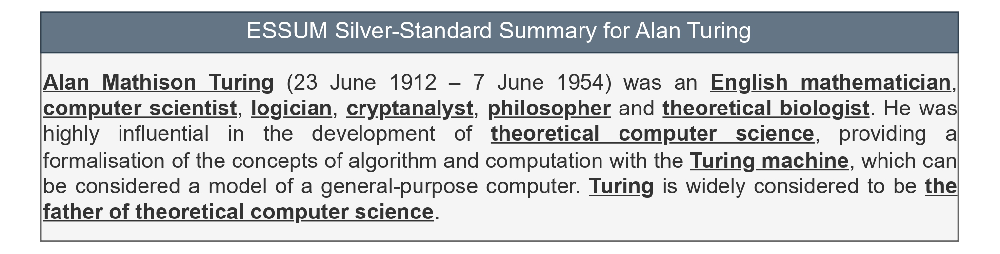

# ANTS: Knowledge Graph Abstractive Entity Summarization

Our approach aims to address the challenges of abstractive entity summarization in Knowledge Graphs (KGs) by generating optimal summaries that combine present triples with inferred missing (absent) triples using KG Embeddings (KGE) and Large Language Models (LLM) techniques.

<p align="center">

</p>

**** 
## Repository Structure: 
```
├── data
│   ├── ESBM-DBpedia
│   │   ├── ESSUM
│   │   │   ├── silver-standard-summaries
│   │   │   └── absent
│   │   ├── predictions
│   │   │   ├── ANTS
│   │   │   ├── baselines
│   │   │   ├── KGE
│   │   │   ├── LLM
│   │   │   └── ESSUM-Absent
│   │   └── elist.txt
│   └── FACES
│       ├── ESSUM
│       │   ├── silver-standard-summaries
│       │   └── absent
│       ├── predictions
│       │   ├── ANTS
│       │   ├── baselines
│       │   ├── KGE
│       │   ├── LLM
│       │   └── ESSUM-Absent
│       └── elist.txt
├── evaluation-modules
├── KGE-triples
├── LLM-triples
├── ranking-modules
├── verbalizing-modules
├── LICENSE
└── README.md
```
***
## Setup the environment

To run the ANTS framework, you need to install the following packages:
```
python 3.7+
torch
```

1. Create and activae a Conda enviroment:
```
conda create --name ants python=3.7

conda activate ants
```

2. Install required packages:

After activating the environment, ensure that torch is installed along with other dependencies listed in a requirements file:
```
pip install torch

pip install -r requirements.txt
```

## Data preparation

### ESSUM

A dataset containing silver-standard summaries. These summaries consist of sentences —with mentioned entities—from the first paragraph of the corresponding Wikipedia page for each target entity.

<p align="center">

</p>

### ESSUM-Absent
The second dataset used in our experiments, which includes entities with their golden summaries from ESBM-DBpedia and FACES datasets. In particular, 80% of the entities with their summaries (i.e., the golden set of RDF triples) are retained as present triples. The remaining 20% of the entities are excluded from the datasets and treated as absent triples.

## ANTS Framework Components

Our approach has two components: KGE-triples and LLM-triples

### KGE-triples

KGE-Triples leverages [LiteralE framework](https://github.com/SmartDataAnalytics/LiteralE) to produce the triples. Several models are available for this task, including ConvE and its extended combination with LiteralE.

#### Setup for KGE-triples:
```
# Clone the LiteralE repository
git clone https://github.com/SmartDataAnalytics/LiteralE.git

# Navigate to the LiteralE directory and download the DBpedia dataset
cd LiteralE/data
wget https://zenodo.org/records/10991461/files/dbpedia34k.tar.gz
tar -xvf dbpedia34k.tar.gz

# Run the script to update LiteralE modules
cd ..
bash update-LiteralE-modules.sh

# may you need install this library
python -m spacy download en_core_web_sm

# Execute the script for missing triples prediction (KGE model = LiteralE)
python run_missing_triples_prediction.py dataset dbpedia34k model Conve_text input_drop 0.2 embedding_dim 100 batch_size 1 epochs 100 lr 0.001 process True

```

### LLM-triples

This component leverages a Large Language Model (LLM), such as GPT, to extend its application to knowledge graph (KG) completion tasks, including triple classification, relation prediction, and the completion of missing triples. As illustrated below, the ANTS approach integrates the LLM-triples component, such as GPT-4, to address the inherent limitations of KGE methods in inferring literal triples.

<p align="center">

</p>

##### Usage
```
# Navigate to the LLM-triples folder
cd LLM-triples

# Run the script for missing triples prediction
python run_missing_triples_prediction.py
```
### Triples Ranking

Triples ranking utilizes the frequency of predicate occurrences within the knowledge graph, such as DBpedia. Predicates that occur most frequently will prioritize their corresponding triples at the top of the list. Run the ```triples-ranking``` process (which includes the ranking process and preprocessing to convert RDF triples to textual format for subsequent verbalization).

```
cd ranking-modules
python triples-ranking.py  --kge_model conve_text --llm_model gpt-4 --combined_model conve_text_gpt-4 --dataset ESBM-DBpedia --base_model ANTS
```

### Verbalizing RDF triples into Abstract Summary:

1. Download pre-trained model for verbalizing the abstractive summaries and under the folder verbalization-modules. Link verbalization-P2 model: https://zenodo.org/records/10984714
2. Run verbalizing modules:
```
cd verbalization-modules
python verbalization-process.py --dataset ESBM-DBpedia --system conve_gpt-4 --base_model ANTS --semantic_constraints True
```

### Evaluation

#### Preparing data for evaluation

Before we run the evaluation, we need to convert the results to evaluation format file. To do it, run code as follows:
```
cd evaluation-modules
python converting-to-evaluation-format.py --system "conve" --dataset "ESBM-DBpedia" --base_model "KGE" --semantic_constraints
```

To conduct the evaluation see [evaluation-modules page](https://github.com/u2018/ANTS/tree/main/evaluation-modules/README.md).
