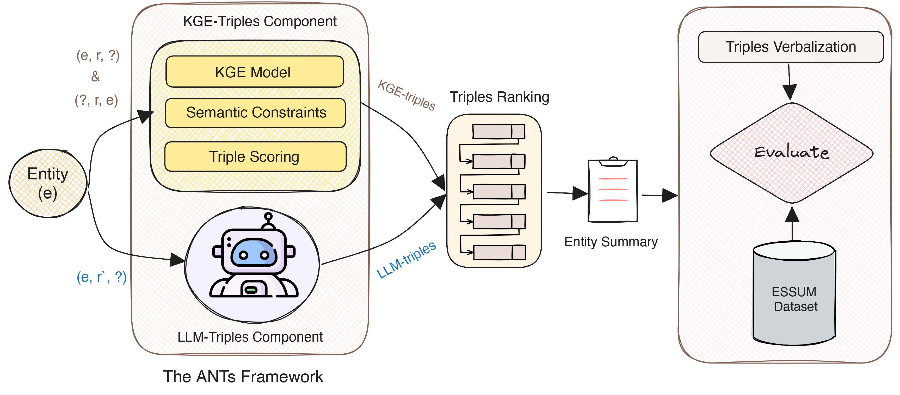

# ANTS: Knowledge Graph Abstractive Entity Summarization

Our approach aims to address the challenges of abstractive entity summarization in Knowledge Graphs (KGs) by generating optimal summaries that combine present triples with inferred missing (absent) triples using KG Embeddings (KGE) and Large Language Models (LLM) techniques.

<p align="center">

</p>

## Repository Structure: 
```
├── data
│   ├── essum-dbpedia
├── LICENSE
└── README.md
```

## Data preparation
### Create essum dataset
The Essum dataset is derived from ESBM (version 1.2) and is designed to evaluate our approach, which combines absent triples with present triples to construct entity summaries. The dataset is created through the following procedures:

1. Prepare the dataset from DBpedia based on ESBM (version 1.2), which contains 125 entities with 4436 triples.
2. For evaluation purposes, we remove 20% of the triples from each entity description through automatic random selection.
3. The removed triples will be stored as the test set, while the remaining triples will be divided into training and validation sets with a 90:10 ratio.