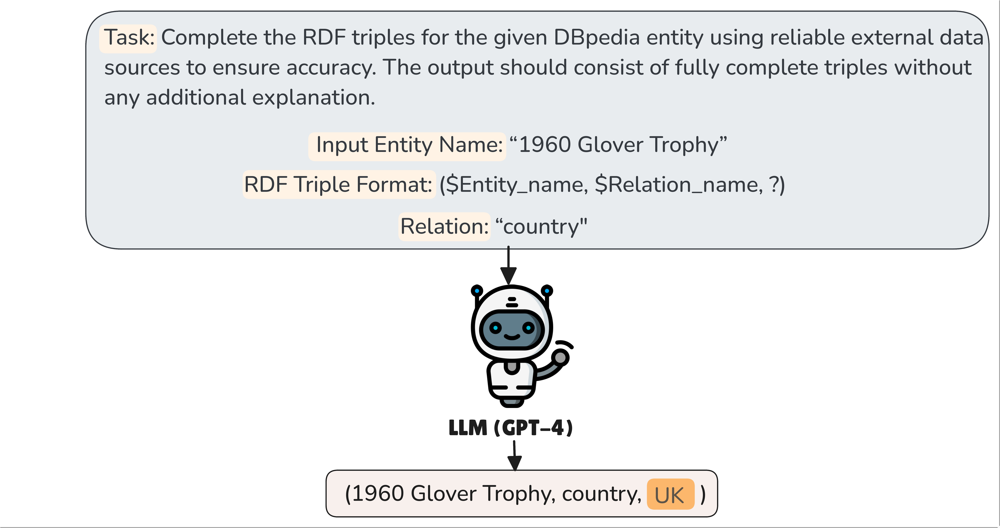

# ANTS: Knowledge Graph Abstractive Entity Summarization


This repository contains the implementation of ANTS, a research paper accepted at ESWC 2025 (Research Track). ANTS addresses the challenges of abstractive entity summarization in Knowledge Graphs (KGs) by generating optimal summaries that integrate existing triples with inferred (absent) triples. It leverages Knowledge Graph Embeddings (KGE) and Large Language Models (LLMs) to enhance summarization quality.

<p align="center">

</p>

## 🚀 Table of Contents
- [About the Project](#-about-the-project)
- [Installation](#%EF%B8%8F-installation)
- [Repository Structure](#-repository-structure)
- [Dataset](#-datasets)
- [Usage](#%EF%B8%8F-usage)
- [How to Cite](#how-to-cite)
- [contact](#contact)
---
## 📌 About the Project
ANTS generates entity summaries in natural language from Knowledge Graphs by leveraging both KGE and LLM techniques. It addresses the problem of missing information by predicting absent triples and verbalizing them into readable summaries.

---
## ⚙️ Installation
To run the ANTS framework, you need to install the following packages:

```bash
python 3.7+
torch
```

1. Create and activate a Conda environment:
```bash
conda create --name ants python=3.7
conda activate ants
```
2. Download the project
```bash
git clone https://github.com/dice-group/ANTS.git

# Navigate to ANTS directory
cd ANTS
```

2. Install required packages:
```bash
pip install torch
pip install -r requirements.txt
```

> ⚠️ **Important Note:** Ensure that all dependencies are correctly installed.

---
## 📂 Repository Structure
```
├── data
│   ├── ESBM-DBpedia
│   │   ├── ESSUM
│   │   │   ├── silver-standard-summaries
│   │   │   └── absent
│   │   ├── predictions
│   │   │   ├── ANTS
│   │   │   ├── baselines
│   │   │   ├── KGE
│   │   │   └── LLM
│   │   └── elist.txt
│   └── FACES
│       ├── ESSUM
│       │   ├── silver-standard-summaries
│       │   └── absent
│       ├── predictions
│       │   ├── ANTS
│       │   ├── baselines
│       │   ├── KGE
│       │   └── LLM
│       └── elist.txt
├── src
├── ├── evaluation-modules
├── ├── KGE-triples
├── ├── LLM-triples
├── ├── ranking-modules
├── └──verbalizing-modules
├── LICENSE
└── README.md
```
## 📊 Datasets

### ESSUM (Silver-standard-summaries)

ESSUM is a silver-standard dataset that combines entities from ESBM-DBpedia and FACES. For each entity, we extract sentences with mentioned entities from the first paragraph of its Wikipedia page. In our experiments, we created two subsets:

- **ESSUM-DBpedia** (110 entities from ESBM-DBpedia):  
  [https://github.com/dice-group/ANTS/tree/main/data/ESBM-DBpedia/ESSUM/silver-standard-summaries](https://github.com/dice-group/ANTS/tree/main/data/ESBM-DBpedia/ESSUM/silver-standard-summaries)

- **ESSUM-FACES** (50 entities from FACES):  
  [https://github.com/dice-group/ANTS/tree/main/data/FACES/ESSUM/silver-standard-summaries](https://github.com/dice-group/ANTS/tree/main/data/FACES/ESSUM/silver-standard-summaries)

<p align="center">

</p>

### ESSUM-ABSENT

Derived by randomly removing 20% of triples from ESBM-DBpedia and FACES. These omitted triples serve as ground-truth absent triples to evaluate a model’s ability to infer missing facts.


---
## 🛠️ Usage
### **1️⃣ KGE-Triples**

#### Setup LiteralE Framework
```bash
cd src/KGE-triples

# Clone the LiteralE repository
git clone https://github.com/SmartDataAnalytics/LiteralE.git

# Navigate to the LiteralE directory and download the DBpedia dataset
cd LiteralE/data
wget https://zenodo.org/records/10991461/files/dbpedia34k.tar.gz
tar -xvf dbpedia34k.tar.gz

# back to KGE-triples folder
cd ../..

# Update LiteralE modules
bash update-LiteralE-modules.sh

```
Note:
You need some requirements manually inside the LiteralE folder, such as:
- spodernet library: https://github.com/TimDettmers/spodernet
- bashmagic library: https://github.com/TimDettmers/bashmagic

#### Run Missing Triple Predictions
```bash
## Navigate to the KGE-triples directory 
cd src/KGE-triples

# Execute the script for missing triples prediction
python run_missing_triples_prediction.py dataset dbpedia34k model ConvE_text input_drop 0.2 embedding_dim 100 batch_size 1 epochs 100 lr 0.001 process True
```

### **2️⃣ LLM-Triples**
This component leverages a Large Language Model (LLM), such as GPT, to extend its application to knowledge graph (KG) completion tasks, including triple classification, relation prediction, and the completion of missing triples. As illustrated below, the ANTS approach integrates the LLM-triples component, such as GPT-4, to address the inherent limitations of KGE methods in inferring literal triples.

<p align="center">

</p>

```bash
cd src/LLM-triples
# Execute the script for missing triples prediction
python run_missing_triples_prediction.py --model <gpt-model> --system gpt-4 --dataset ESSUM-DBpedia

# Execute the script for post-processing 
python post_processing.py --system gpt-4 --dataset ESSUM-DBpedia
```
### **3️⃣ Triple-Ranking And Entity Summary**
Triples ranking utilizes the frequency of predicate occurrences within the knowledge graph, such as DBpedia. Predicates that occur most frequently will prioritize their corresponding triples at the top of the list. Run the ```triples-ranking``` process (which includes the ranking process and entity summary).

```
# Navigate to ranking-modules directory
cd src/ranking-modules

# Run triple-ranking and entity summary
python triples-ranking.py  --kge_model conve_text --llm_model gpt-4 --combined_model conve_text_gpt-4 --dataset ESSUM-DBpedia --base_model ANTS
```
### **4️⃣ Evaluation Protocol**
Provides automatic evaluation of verbalized summaries using multiple NLP metrics.

#### Step 1: Verbalizing Entity Summary

Requirement:
- Download the pre-trained model for verbalizing the abstractive summaries. Link verbalization-P2 model: https://zenodo.org/records/10984714
- Move the pre-trained model to the verbalization-modules directory.

```
# Navigate to verbalizing-modules directory
cd verbalizing-modules

# Execute the script for verbalizing entity summary
python verbalization-process.py --dataset ESSUM-DBpedia --system conve_text_gpt-4 --base_model ANTS --semantic_constraints True
```

#### Step 2: Convert Triples into Evaluation Format
```
# Navigate to evaluation-modules directory
cd src/evaluation-modules

# Run converting verbalization results to evaluation format
python converting-to-evaluation-format.py --system "conve_text_gpt-4" --dataset "ESSUM-DBpedia" --base_model "ANTS" --semantic_constraints
```

#### Step 3: Evaluate Experiment Results using BLEU, METEOR, ChrF++, BLEURT
```
# Make sure the directory still in src/evaluation-modules directory
cd GenerationEval

# Execute the script to perform automatic evaluation
python eval.py -R ../../data/ESBM-DBpedia/predictions/ANTS/semantic-constraints/conve_text_gpt-4/evaluation/refs.txt -H ../../data/ESBM-DBpedia/predictions/ANTS/semantic-constraints/conve_text_gpt-4/evaluation/hyp.txt -lng en -nr 1 -m bleu,meteor,chrf++,ter,bert,bleurt
```
---
## How to Cite
```bibtex
@InProceedings{ANTS2025,
  author     = {Firmansyah, Asep Fajar and Zahera, Hamada M. and Sherif, Mohamed Ahmed and and Moussallem, Diego and Ngonga Ngomo, Axel-Cyrille},
  title      = {ANTS: Abstractive Entity Summarization in Knowledge Graphs},
  editors    = {Curry, Edward and Acosta, Maribel and Poveda-
Villalón, María and van Erp, Marieke and Ojo, Adegboyega and Hose, Katja and Shimizu, Cogan and Lisena, Pasquale},
  booktitle  = {Semantic Web – 22nd International Conference, ESWC 2025, Portoroz, Slovenia, June 1-5, 2025, Proceedings},
  year       = {2025},
  keywords   = {dice enexa whale trr318 firmansyah zahera sherif moussallem ngonga},
  url        = {https://papers.dice-research.org/2025/ESWC_ANTS/public.pdf}
}
```
---
## Contact
If you have any questions or feedbacks, feel free to contact us at asep.fajar.firmansyah@upb.de

